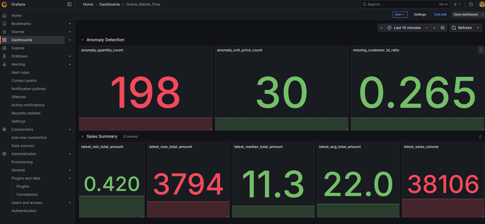

# interview-infrastructure: Data Pipeline Execution Environment

本專案使用 **[k3d](https://k3d.io/)** 建立本地 Kubernetes (k8s) 叢集，並透過 **ArgoCD** 實現完整的 **GitOps** 模式。所有基礎設施與應用程式配置 (包含資料庫、排程、監控、視覺化) 均以聲明式 (Declarative) 方式管理。

## 專案目標

1.  **GitOps 實現：** 使用 **ArgoCD** 集中管理 Kubernetes 資源，達成環境一鍵部署。
2.  **核心服務部署：** 部署 **PostgreSQL, ClickHouse, Prefect, Metabase, Prometheus, Grafana** 六大核心服務。
3.  **環境可重現性：** 確保所有服務的配置和相互連接關係是明確且可驗證的。

### 專案結構

```
argocd/
├── bootstrap/ # 用於安裝與初始化 ArgoCD 本身
└── clusters/
├── apps/
│ └── <app-folders> # 各應用程式的設定 (Helm 或 YAML)
├── applicationset.yaml # ApplicationSet 定義，會自動同步 apps/ 下的應用
├── component # 將應用程式元件化，以利部署時使用
└── pic : 執行結果的截圖
```

---

## 前置需求

- [Docker](https://docs.docker.com/get-docker/)  
- [k3d](https://k3d.io/)  
- [kubectl](https://kubernetes.io/docs/tasks/tools/)
- [kubectx+kubens](https://github.com/ahmetb/kubectx)

---

## 🚀 部署流程 (End-to-End Deployment)

### 1. 建立 Cluster 與 Node Pool 模擬

建立名為 `infrastructure` 的 k3d cluster，並建立多個 Agent Nodes 以模擬 GKE NodePool，便於後續應用程式使用 $nodeSelector$ 進行部署隔離和資源分配。

```bash
# 建立基礎叢集
k3d cluster create infrastructure

# 建立多個 Agent Nodes 並貼上模擬的 GKE 標籤 (確保服務隔離與親和性)
k3d node create clickhouse-operator --role agent --cluster infrastructure --k3s-node-label "cloud.google.com/gke-nodepool=clickhouse-operator"
k3d node create clickhouse-server --role agent --cluster infrastructure --k3s-node-label "cloud.google.com/gke-nodepool=clickhouse" --k3s-node-label "topology.gke.io/zone=asia-east1-a"
k3d node create prometheus --role agent --cluster infrastructure --k3s-node-label "cloud.google.com/gke-nodepool=prometheus"
k3d node create metabase --role agent --cluster infrastructure --k3s-node-label "cloud.google.com/gke-nodepool=metabase"
k3d node create postgresql --role agent --cluster infrastructure --k3s-node-label "cloud.google.com/gke-nodepool=postgresql"
k3d node create grafana --role agent --cluster infrastructure --k3s-node-label "cloud.google.com/gke-nodepool=grafana"
k3d node create prefect --role agent --cluster infrastructure --k3s-node-label "cloud.google.com/gke-nodepool=prefect"
k3d node create prometheus-prefect-exporter --role agent --cluster infrastructure --k3s-node-label "cloud.google.com/gke-nodepool=prometheus-prefect-exporter"
k3d node create prefect-work-pool --role agent --cluster infrastructure --k3s-node-label "cloud.google.com/gke-nodepool=prefect-work-pool"

# 驗證所有 Node 狀態
kubectl get nodes
```

### 2. 部署 ArgoCD 與啟動 GitOps

手動部署 ArgoCD 本身後，即可將整個應用程式清單交由 GitOps 管理。

```bash
# 2.1 安裝 ArgoCD (使用 Kustomize 安裝)
kubectl apply -k argocd/bootstrap/

# 2.2 部署 Applicationset (啟動 GitOps 流程)
# ApplicationSet 會自動同步 argocd/clusters/apps/ 目錄下所有應用
kubectl apply -k argocd/clusters/apps/applicationset.yaml
```

### 3. 存取 ArgoCD UI

```bash
# 取得初始密碼
kubectl get secret argocd-initial-admin-secret -n argocd -o jsonpath="{.data.password}" | base64 -d

# 透過 port-forward 存取 UI
kubectl port-forward svc/argocd-server -n argocd 8080:443
```
開啟瀏覽器，進入 [https://localhost:8080](https://localhost:8080)，使用帳號 admin 登入。

---

## ⚙️ 核心服務連接與配置管理 (IaC & Secrets)

所有服務的連接參數 (資料庫連線字串、API Key 等) 均由 $ArgoCD$ 讀取 $argocd/clusters/apps/$ 目錄下的 **Secret** 和 **ConfigMap** 資源，並注入到 $Deployment$ 的環境變數中，確保 IaC 的安全性與一致性。

### 1. 資料庫連接與職責

整個環境依賴於兩個資料庫，職責明確區分：

| 資料庫 | 職責 | 連接服務 | K8s Secret/ConfigMap 依賴 |
| :--- | :--- | :--- | :--- |
| **PostgreSQL** | 應用程式組態 (Metadata) | Prefect, Metabase | `postgresql-credentials` |
| **ClickHouse** | 交易數據倉儲 (OLAP) | Prefect Agent, Grafana | `clickhouse-credentials` |

### 2. 資料庫初始化 (Initialization)

$ArgoCD$ 負責部署 $DB$ 實例，但 $Schema$ 初始化需透過 $Job$ 或手動執行。

| 資料庫 | 初始化 $SQL$ 路徑 | 初始化目的 |
| :--- | :--- | :--- |
| **PostgreSQL** | `argocd/clusters/apps/database/postgresql/init.sql` | 建立 $Prefect$ 和 $Metabase$ 專用的 $database/schema$。 |
| **ClickHouse** | **(來自 interview-pipeline 專案)** | 建立 $raw, vault, marts, quality$ 四個資料庫。 |

> **PostgreSQL 初始化步驟:**
> 1. 執行 `kubectl port-forward service/postgresql 5432:5432 -n database` 建立連線。
> 2. 使用 DB 工具 (如 DBeaver) 連線並執行 $init.sql$ 腳本。

### 3. 監控配置 (Grafana & Prometheus)

* **Prometheus**: $Deployment$ 中配置 $ServiceMonitor$ 資源，自動發現並抓取 $Prefect$ (flow metrics) 和 $ClickHouse$ 的 $Metrics$ $Endpoint$。
* **Grafana**: 透過 $Provisioning$ $ConfigMap$：
    * 預先設置 **ClickHouse** 為 $DataSource$，用於視覺化 $Marts$ 層數據。
    * 預先設置 **Prometheus** 為 $DataSource$，用於視覺化 $notification.py$ 腳本發送的 $ETL$ 品質指標。

---

## (Optional) Grafana 設置 

在這個 repository 中，ArgoCD 會同時安裝 Prometheus 與 Grafana。  
以下說明如何在 Grafana 中設置 Prometheus 作為資料來源，並顯示關注的 metrics。

與此 repository 搭配的 ELT pipeline [interview-pipeline](https://github.com/zhweiliu/interview-pipeline) 會定期將關注指標輸出到 Prometheus。

### 設置 Prometheus 作為 Data Source

將 Grafana service port-forward 到 local

```bash
kubectl port-forward service/grafana 3000:3000 -n monitoring
```

開啟瀏覽器，訪問：
```bash
localhost:3000
```

左側選單點擊 **Data sources** → 右上角 **+ Add new data source** → 選擇 **Prometheus**。

在 **Connection** 欄位輸入 Prometheus server URL：

```bash
http://app-prometheus-server.prometheus.svc.cluster.local:80
```

點擊最下方 **Save & test** 儲存。

### 增加 Dashboard 與 Panels

[interview-pipeline](https://github.com/zhweiliu/interview-pipeline) 每天執行完成後，會輸出以下 metrics 到 Prometheus：

**Anomaly Detection**
* **anomaly_unit_price_count** : 單價異常資料筆數  
* **anomaly_quantity_count** : 數量異常資料筆數  
* **missing_customer_id_ratio** : 資料集缺失 Customer ID 的比例  

**Sales Summary**
* **latest_min_total_amount** : 當日交易最小總金額  
* **latest_max_total_amount** : 當日交易最大總金額  
* **latest_median_total_amount** : 當日交易總金額中位數  
* **latest_avg_total_amount** : 當日交易總金額平均數  
* **latest_sales_volume** : 當日所有交易加總金額  

設置完成後，Dashboard 顯示效果如下：


